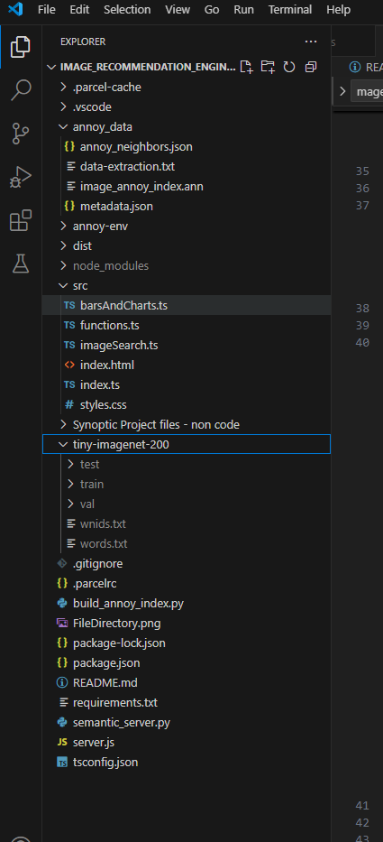

# Image Recommendation Engine

This project implements an image recommendation engine that uses TensorFlow.js, MobileNet, and Annoy for efficient image retrieval based on user preferences.

## Dataset

The general image dataset used can be found here : ``` https://cs231n.stanford.edu/tiny-imagenet-200.zip ```

Please download and extract this dataset into the `tiny-imagenet-200` folder within the project root, as shown in the directory structure below.

## How to train the model for the current dataset (can be switched out for another one in the future)

1.  **Extract Image Features:**

    Before running the servers or front-end, you need to extract image features and create the necessary metadata files. This is done using Python.

    * Ensure you have Python 3.10 installed.

    * Navigate to the project directory in your terminal.

    * Create a Python virtual environment (recommended):

        ```
       python3 -m venv annoy-env 
       annoy-env\Scripts\activate  # On Windows
        ```

    * Install the required Python dependencies:

        ```
        pip install -r requirements.txt
        ```

    * Run the image feature extraction script:

        ```
        python build_annoy_index.py 
        ```

    This script will process the images in the `tiny-imagenet-200` folder and generate the `annoy_data` directory, which contains the index and metadata files necessary for the recommendation engine.


2.  **Directory Structure:**

    Before running the servers, your file directory should look like this:

 
    

3.  **Run the Servers:**

    Open three separate terminal windows and run the following commands in each:
    
    **Note:** If your node version is very old, you may need to update it. this project was created with v22.14.0

    * **Terminal 1 (Python Server):**

        ```
        python semantic_server.py
        ```

    * **Terminal 2 (Node.js Server):**

        ```
        node server.js
        ```

    * **Terminal 3 (Front-end):**

        ```
        npm run start
        ```

4.  **Access the Application:**

    Once all three servers are running, open your web browser and navigate to `http://localhost:8080`.

    Then you should be able to test the app and curate your own image recommendations.
